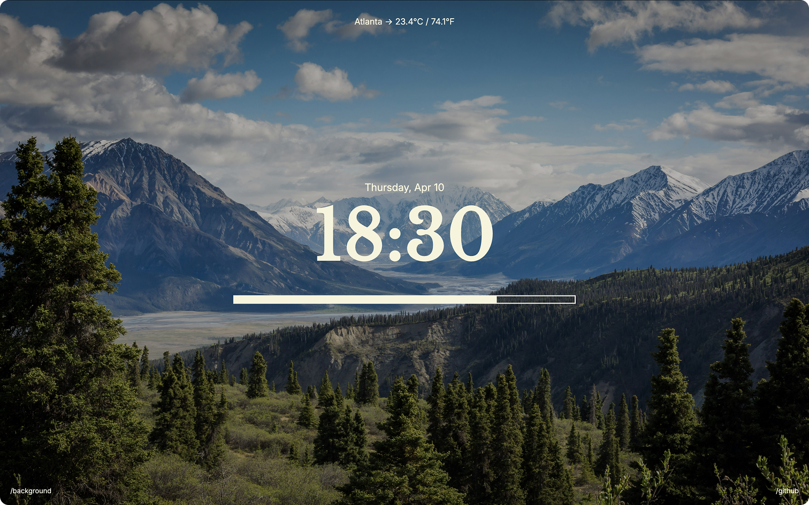

<h1 align="center">Vista-fork</h1>

**Vista-fork** is a fork of the **Vista** extension. **Vista** is a no-nonsense browser start page that displays the **current time**, **date**, **weather**, a **day progress bar**, and a **unique background for each day of the week**.  
No widgets, no clutter. Just calm.

## Available on:

- [Chrome Web Store](https://chromewebstore.google.com/detail/vista/ikkbpjhalcjblggbcbmcofpcfhfhplkn)
- [Edge Add-ons](https://microsoftedge.microsoft.com/addons/detail/vista/nhbgakokookoeiplielcigoldnbnaalo)
- [Firefox Add-ons](https://addons.mozilla.org/en-US/firefox/addon/vista/)

## Features

- Minimal new tab showing current time in 24-hour format
- Displays current day and date (e.g., Saturday, Feb 10)
- Visual day progress bar that fills as time passes
- Real-time weather fetched from IP-based location (°C & °F)
- Unique background image for each day of the week
- Fully responsive and distraction-free

## Tech Stack

- [React](https://react.dev/)
- [Vite](https://vitejs.dev/)
- [TypeScript](https://www.typescriptlang.org/)

## Credits

- Backgrounds via [Unsplash](https://unsplash.com)

## License

This project is licensed under [MIT](LICENSE).
